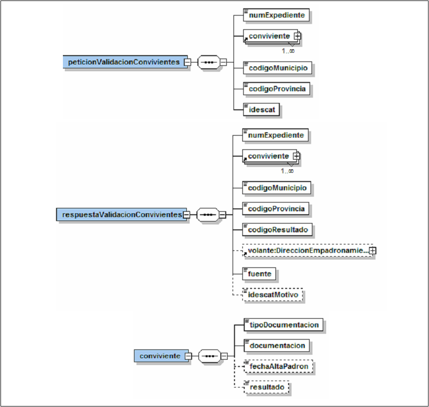
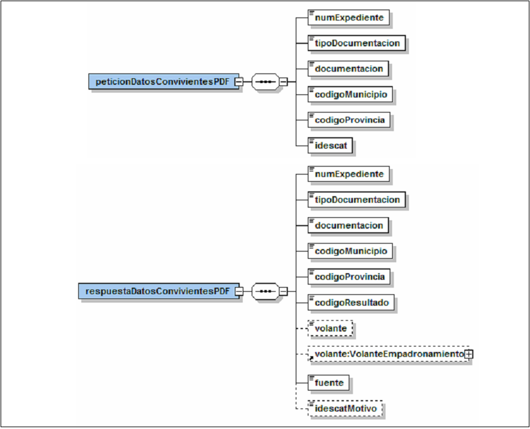

# Via Oberta – Padró Municipal d’Habitants
Document d’integració del servei.

Podreu trobar els XSD's del servei en aquest repositori sota el directori [/schema](https://github.com/ConsorciAOC/PADRO/tree/main/schema).

## Control del document

### Informació general

| **Títol:** | Via Oberta – Padró. Document d'integració del servei |
| --- | --- |
| **Creat per:** | Departament de Projectes |
| **A revisar per:** | Departament de Projectes |
| **A aprovar per:** | Departament de Projectes |
| **Llista de distribució:** | |
| **Nom del document:** | DI - Via Oberta - PADRO.doc |

### Històric de revisions

| **Versió** | **Data** | **Autor** | **Comentaris** |
| --- | --- | --- | --- |
| V1.0 | 16/12/2008 | Roger Noguera i Arnau | Creació del document basat en DS\_Padro PCI2 v3.1.doc. |
| V1.1 | 06/02/2009 | Roger Noguera i Arnau | Modificacions a la modalitat TITULAR\_INE. |
| V1.2 | 16/03/2009 | Roger Noguera i Arnau | Modificacions a la modalitat TITULAR\_INE (elements nom i cognoms optatius). |
| V1.3 | 16/04/2009 | Roger Noguera i Arnau | Joc de proves. |
| V1.4 | 13/04/2010 | Roger Noguera i Arnau | Incorpora TITULAR\_IDESCAT. |
| V1.5 | 15/07/2011 | Roger Noguera i Arnau | Nou codi de retorn per consultes contra municipis no adherits. |
| V1.6 | 05/02/2013 | Roger Noguera i Arnau | Incorpora TITULAR\_PROPI i CONVIVENTS\_PROPI. |
| V2.0 | 16/03/2015 | Roger Noguera i Arnau | Extinció de TITULAR\_INE. |
| V2.1 | 22/11/2022 | Suport Tècnic AOC | Afegir casos de prova per l'entorn de PRE. |

### Índex

- [1. Introducció](#1)
- [2. Transmissions de dades disponibles](#2)
- [3. Missatgeria dels serveis](#3)
   * [3.1. Residència d'un individu a Catalunya (RESIDENT)](#3.1)
   * [3.2. Municipi de residència d'un individu (MUNICIPI\_RESIDENCIA)](#3.2)
   * [3.3. Residència d'un individu a un determinat municipi (RESIDENT\_MUNICIPI)](#3.3)
   * [3.4. Número de convivents d'un individu (NUMERO\_CONVIVENTS)](#3.4)
   * [3.5. Comprovació del número de convivents (COMPROVACIO\_CONVIVENTS)](#3.5)
   * [3.6. Dades del titular (TITULAR i TITULAR\_PROPI)](#3.6)
   * [3.7. Dades dels convivents (CONVIVENTS i CONVIVENTS\_PROPI)](#3.7)
   * [3.8. Validació dels convivents (VALIDACIO\_CONVIVENTS)](#3.8)
   * [3.9. Dades del titular PDF (TITULAR\_PDF)](#3.9)
   * [3.10. Dades dels convivents PDF (CONVIVENTS\_PDF)](#3.10)
   * [3.11. Dades del titular IDESCAT (TITULAR\_IDESCAT)](#3.11)
   * [3.12. Cerca del titular (TITULAR\_CERCA)](#3.12)
- [4. Joc de proves 13](#4)

## 1 Introducció <a name="1"></a>

Aquest document detalla la missatgeria associada al servei del Padró Municipal d'Habitants (Padró en endavant).

Per poder realitzar la integració cal conèixer prèviament la següent documentació:

- Document del Servei Via Oberta.
- [Document de Missatgeria Genèrica de la PCI del Consorci AOC.][PCI]

[PCI]:https://github.com/ConsorciAOC/PCI

## 2 Transmissions de dades disponibles <a name="2"></a>

Les dades disponibles a través del servei són les que es presenten a continuació:
- **EMISSOR**: CAOC (Consorci Administració Oberta de Catalunya)

| **PRODUCTE** | **MODALITAT** | **DESCRIPCIO** |
| --- | --- | --- |
| **PADRO** | [RESIDENT](#3.1) | Residència d'un individu a Catalunya.|
| **PADRO** | [MUNICIPI\_RESIDENCIA](#3.2) | Municipi de residència d'un individu. |
| **PADRO** | [RESIDENT\_MUNICIPI](#3.3) | Residència d'un individu a un determinat municipi.|
| **PADRO** | [NUMERO\_CONVIVENTS](#3.4) | Número de convivents d'un individu.|
| **PADRO** | [COMPROVACIO\_CONVIVENTS](#3.5) | Comprovació del número de convivents.|
| **PADRO** | [TITULAR](#3.6) | Dades del titular.|
| **PADRO** | [CONVIVENTS](#3.7) | Dades dels convivents.|
| **PADRO** | [VALIDACIO\_CONVIVENTS](#3.8) | Validació dels convivents.|
| **PADRO** | [TITULAR\_PDF](#3.9) | Dades del titular (PDF).|
| **PADRO** | [CONVIVENTS\_PDF](#3.10) | Dades dels convivents (PDF).|
| **PADRO** | [TITULAR\_IDESCAT](#3.11) | Dades del titular (consulta alternativa a l'IDESCAT).|
| **PADRO** | [TITULAR\_PROPI](#3.6) | Dades del titular (consulta al padró de l'ens requeridor). Únicament disponible per a Administracions Locals.|
| **PADRO** | [CONVIVENTS\_PROPI](#3.7) | Dades dels convivents (consulta al padró de l'ens requeridor). Únicament disponible per a Administracions Locals.|
| **PADRO** | [TITULAR\_CERCA](#3.12) | Cerca del titular.|

## 3 Missatgeria dels serveis <a name="3"></a>

A continuació es detalla la missatgeria corresponent al bloc de dades específiques de les modalitats de consum del producte Padró.

### 3.1 Residència d'un individu a Catalunya (RESIDENT) <a name="3.1"></a>

<p align="center">

</p>  

| _Element_ | _Descripció_ |
| --- | --- |
| peticionResidente/numExpediente | Número d'expedient |
| peticionResidente/tipoDocumentacion | 1: NIF, 2: passaport, 3: permís residència/NIE |
| peticionResidente/documentacion | Documentació |
| respuestaResidente/numExpediente | Número d'expedient |
| respuestaResidente/tipoDocumentacion | 1: NIF, 2: passaport, 3: permís residència/NIE |
| respuestaResidente/documentacion | Documentació |
| respuestaResidente/codigoResultado | 1: CONSTA, 2: NO CONSTA, 3: ERROR |

### 3.2 Municipi de residència d'un individu (MUNICIPI\_RESIDENCIA) <a name="3.2"></a>

<p align="center">

</p>  

| _Element_ | _Descripció_ |
| --- | --- |
| peticionMunicipioResidencia/numExpediente | Número d'expedient |
| peticionMunicipioResidencia/tipoDocumentacion | 1: NIF, 2: passaport, 3: permís residència/NIE |
| peticionMunicipioResidencia/documentacion | Documentació |
| respuestaMunicipioResidencia/numExpediente | Número d'expedient |
| respuestaMunicipioResidencia/tipoDocumentacion | 1: NIF, 2: passaport, 3: permís residència/NIE |
| respuestaMunicipioResidencia/documentacion | Documentació |
| respuestaMunicipioResidencia/codigoResultado | 1: CONSTA, 2: NO CONSTA, 3: ERROR |
| respuestaMunicipioResidencia/codigoMunicipio | Codi de municipi |
| respuestaMunicipioResidencia/codigoProvincia | Codi de província |

### 3.3 Residència d'un individu a un determinat municipi (RESIDENT\_MUNICIPI) <a name="3.3"></a>

<p align="center">

</p>  


| _Element_ | _Descripció_ |
| --- | --- |
| peticionResidenteMunicipio/numExpediente | Número d'expedient |
| peticionResidenteMunicipio/tipoDocumentacion | 1: NIF, 2: passaport, 3: permís residència/NIE |
| peticionResidenteMunicipio/documentacion | Documentació |
| peticionResidenteMunicipio/codigoMunicipio | Codi de municipi |
| peticionResidenteMunicipio/codigoProvincia | Codi de província |
| peticionResidenteMunicipio/idescat | 1: _failover_ contra servei d'Idescat, 0: sense _failover_ |
| respuestaResidenteMunicipio/numExpediente | Número d'expedient |
| respuestaResidenteMunicipio/tipoDocumentacion | 1: NIF, 2: passaport, 3: permís residència/NIE |
| respuestaResidenteMunicipio/documentacion | Documentació |
| respuestaResidenteMunicipio/codigoMunicipio | Codi de municipi |
| respuestaResidenteMunicipio/codigoProvincia | Codi de província |
| respuestaResidenteMunicipio/codigoResultado | 1: CONSTA, 2: NO CONSTA, 3: ERROR, 4: MUNICIPI NO ADHERIT |
| respuestaResidenteMunicipio/fuente | PADRON o IDESCAT |
| respuestaResidenteMunicipio/idescatMotivo | 1: municipi no adherit, 2: servei del municipi no disponible en el moment de la consulta |

### 3.4 Número de convivents d'un individu (NUMERO\_CONVIVENTS) <a name="3.4"></a>

<p align="center">

</p>  

| _Element_ | _Descripció_ |
| --- | --- |
| peticionNumeroConvivientes/numExpediente | Número d'expedient |
| peticionNumeroConvivientes/tipoDocumentacion | 1: NIF, 2: passaport, 3: permís residència/NIE |
| peticionNumeroConvivientes/documentacion | Documentació |
| peticionNumeroConvivientes/codigoMunicipio | Codi de municipi |
| peticionNumeroConvivientes/codigoProvincia | Codi de província |
| peticionNumeroConvivientes/idescat | 1: _failover_ contra servei d'Idescat, 0: sense _failover_ |
| respuestaNumeroConvivientes/numExpediente | Número d'expedient |
| respuestaNumeroConvivientes/tipoDocumentacion | 1: NIF, 2: passaport, 3: permís residència/NIE |
| respuestaNumeroConvivientes/documentacion | Documentació |
| respuestaNumeroConvivientes/codigoMunicipio | Codi de municipi |
| respuestaNumeroConvivientes/codigoProvincia | Codi de província |
| respuestaNumeroConvivientes/codigoResultado | 1: CONSTA, 2: NO CONSTA, 3: ERROR, 4: MUNICIPI NO ADHERIT |
| respuestaNumeroConvivientes/numeroConvivientes | Número de convivents (incloent el titular) |
| respuestaNumeroConvivientes/DireccionEmpadronamiento | Bloc de dades corresponent a la direcció d'empadronament del volant |
| respuestaNumeroConvivientes/fuente | PADRON o IDESCAT |
| respuestaNumeroConvivientes/idescatMotivo | 1: municipi no adherit, 2: servei del municipi no disponible en el moment de la consulta |

### 3.5 Comprovació del número de convivents (COMPROVACIO\_CONVIVENTS) <a name="3.5"></a>

<p align="center">

</p>  

| _Element_ | _Descripció_ |
| --- | --- |
| peticionComprobacionConvivientes/numExpediente | Número d'expedient |
| peticionComprobacionConvivientes/tipoDocumentacion | 1: NIF, 2: passaport, 3: permís residència/NIE |
| peticionComprobacionConvivientes/documentacion | Documentació |
| peticionComprobacionConvivientes/codigoMunicipio | Codi de municipi |
| peticionComprobacionConvivientes/codigoProvincia | Codi de província |
| peticionComprobacionConvivientes/numeroConvivientes | Número de convivents (incloent el titular) a validar |
| peticionComprobacionConvivientes/idescat | 1: _failover_ contra servei d'Idescat, 0: sense _failover_ |
| respuestaComprobacionConvivientes/numExpediente | Número d'expedient |
| respuestaComprobacionConvivientes/tipoDocumentacion | 1: NIF, 2: passaport, 3: permís residència/NIE |
| respuestaComprobacionConvivientes/documentacion | Documentació |
| respuestaComprobacionConvivientes/codigoMunicipio | Codi de municipi |
| respuestaComprobacionConvivientes/codigoProvincia | Codi de província |
| respuestaComprobacionConvivientes/numeroConvivientes | Número de convivents (incl. el titular) a validar |
| respuestaComprobacionConvivientes/codigoResultado | 0: NO OK, 1: OK, 2: NO CONSTA, 3: ERROR, 4: MUNICIPI NO ADHERIT |
| respuestaComprobacionConvivientes/DireccionEmpadronamiento | Bloc de dades corresponent a la direcció d'empadronament del volant|
| respuestaComprobacionConvivientes/fuente | PADRON o IDESCAT |
| respuestaComprobacionConvivientes/idescatMotivo | 1: municipi no adherit, 2: servei del municipi no disponible en el moment de la consulta |

### 3.6 Dades del titular (TITULAR i TITULAR\_PROPI) <a name="3.6"></a>

<p align="center">

</p>  

> :warning: En el cas de la modalitat **TITULAR\_PROPI** el codi de municipi i el codi de provincia no s'informen a la petició i la consulta es realitza automàticament contra el padró de l'ens – Administració Local - que realitza la consulta.


| _Element_ | _Descripció_ |
| --- | --- |
| peticionDatosTitular/numExpediente | Número d'expedient |
| peticionDatosTitular/tipoDocumentacion | 1: NIF, 2: passaport, 3: permís residència/NIE |
| peticionDatosTitular/documentacion | Documentació |
| peticionDatosTitular/codigoMunicipio | Codi de municipi. |
| peticionDatosTitular/codigoProvincia | Codi de província |
| peticionDatosTitular/idescat | 1: _failover_ contra servei d'Idescat, 0: sense _failover_ |
| respuestaDatosTitular/numExpediente | Número d'expedient |
| respuestaDatosTitular/tipoDocumentacion | 1: NIF, 2: passaport, 3: permís residència/NIE |
| respuestaDatosTitular/documentacion | Documentació |
| respuestaDatosTitular/codigoMunicipio | Codi de municipi |
| respuestaDatosTitular/codigoProvincia | Codi de província |
| respuestaDatosTitular/codigoResultado | 1: CONSTA, 2: NO CONSTA, 3: ERROR, 4: MUNICIPI NO ADHERIT |
| respuestaDatosTitular/VolanteEmpadronamiento | Bloc de dades corresponent al volant de padró |
| respuestaDatosTitular/fuente | PADRON o IDESCAT |
| respuestaDatosTitular/idescatMotivo | 1: municipi no adherit, 2: servei del municipi no disponible en el moment de la consulta |

### 3.7 Dades dels convivents (CONVIVENTS i CONVIVENTS\_PROPI) <a name="3.7"></a>

<p align="center">

</p>  

> :warning: En el cas de la modalitat **CONVIVENTS\_PROPI** el codi de municipi i el codi de provincia no s'informen a la petició i la consulta es realitza automàticament contra el padró de l'ens –Administració Local- que realitza la consulta.

| _Element_ | _Descripció_ |
| --- | --- |
| peticionDatosConvivientes/numExpediente | Número d'expedient |
| peticionDatosConvivientes/tipoDocumentacion | 1: NIF, 2: passaport, 3: permís residència/NIE |
| peticionDatosConvivientes/documentacion | Documentació |
| peticionDatosConvivientes/codigoMunicipio | Codi de municipi |
| peticionDatosConvivientes/codigoProvincia | Codi de província |
| peticionDatosConvivientes/idescat | 1: _failover_ contra servei d'Idescat, 0: sense _failover_ |
| respuestaDatosConvivientes/numExpediente | Número d'expedient |
| respuestaDatosConvivientes/tipoDocumentacion | 1: NIF, 2: passaport, 3: permís residència/NIE |
| respuestaDatosConvivientes/documentacion | Documentació |
| respuestaDatosConvivientes/codigoMunicipio | Codi de municipi |
| respuestaDatosConvivientes/codigoProvincia | Codi de província |
| respuestaDatosConvivientes/codigoResultado | 1: CONSTA, 2: NO CONSTA, 3: ERROR, 4: MUNICIPI NO ADHERIT |
| respuestaDatosConvivientes/VolanteEmpadronamiento | Bloc de dades corresponent al volant de convivència |
| respuestaDatosConvivientes/fuente | PADRON o IDESCAT |
| respuestaDatosConvivientes/idescatMotivo | 1: municipi no adherit, 2: servei del municipi no disponible en el moment de la consulta |

### 3.8 Validació dels convivents (VALIDACIO\_CONVIVENTS) <a name="3.8"></a>

<p align="center">

</p>  

| _Element_ | _Descripció_ |
| --- | --- |
| peticionValidacionConvivientes/numExpediente | Número d'expedient |
| peticionValidacionConvivientes/conviviente/tipoDocumentacion | 1: NIF, 2: passaport, 3: permís residència/NIE |
| peticionValidacionConvivientes/conviviente/documentacion | Documentació |
| peticionValidacionConvivientes/codigoMunicipio | Codi de municipi |
| peticionValidacionConvivientes/codigoProvincia | Codi de província |
| peticionValidacionConvivientes/idescat | 1: _failover_ contra servei d'Idescat, 0: sense _failover_ |
| respuestaValidacionConvivientes/numExpediente | Número d'expedient |
| respuestaValidacionConvivientes/conviviente/tipoDocumentacion | 1: NIF, 2: passaport, 3: permís residència/NIE |
| respuestaValidacionConvivientes/conviviente/documentacion | Documentació |
| respuestaValidacionConvivientes/conviviente/fechaAltaPadron | Data d'alta al padró, només en el cas del primer convivent emprat per fer la consulta |
| respuestaValidacionConvivientes/conviviente/resultado | 0: NO consta com a convivent 1: consta com a convivent |
| respuestaValidacionConvivientes/codigoMunicipio | Codi de municipi |
| respuestaValidacionConvivientes/codigoProvincia | Codi de província |
| respuestaValidacionConvivientes/codigoResultado | 1: OK, 2: NO CONSTA, 3: ERROR, 4: MUNICIPI NO ADHERIT |
| respuestaComprobacionConvivientes/DireccionEmpadronamiento | Bloc de dades corresponent a la direcció d'empadronament del volant |
| respuestaValidacionConvivientes/fuente | PADRON o IDESCAT |
| respuestaValidacionConvivientes/idescatMotivo | 1: municipi no adherit, 2: servei del municipi no disponible en el moment de la consulta |

### 3.9 Dades del titular PDF (TITULAR\_PDF) <a name="3.9"></a>

<p align="center">

</p>  

| _Element_ | _Descripció_ |
| --- | --- |
| peticionDatosTitularPDF/numExpediente | Número d'expedient |
| peticionDatosTitularPDF/tipoDocumentacion | 1: NIF, 2: passaport, 3: permís residència/NIE |
| peticionDatosTitularPDF/documentacion | Documentació |
| peticionDatosTitularPDF/codigoMunicipio | Codi de municipi |
| peticionDatosTitularPDF/codigoProvincia | Codi de província |
| peticionDatosTitularPDF/idescat | 1: _failover_ contra servei d'Idescat, 0: sense _failover_ |
| respuestaDatosTitularPDF/numExpediente | Número d'expedient |
| respuestaDatosTitularPDF/tipoDocumentacion | 1: NIF, 2: passaport, 3: permís residència/NIE |
| respuestaDatosTitularPDF/documentacion | Documentació |
| respuestaDatosTitularPDF/codigoMunicipio | Codi de municipi |
| respuestaDatosTitularPDF/codigoProvincia | Codi de província |
| respuestaDatosTitularPDF/codigoResultado | 1: CONSTA, 2: NO CONSTA, 3: ERROR, 4: MUNICIPI NO ADHERIT |
| respuestaDatosTitularPDF/volante | Volant de padró signat en format PDF |
| respuestaDatosTitularPDF/VolanteEmpadronamiento | Bloc de dades corresponent al volant de padró |
| respuestaDatosTitularPDF/fuente | PADRON o IDESCAT |
| respuestaDatosTitularPDF/idescatMotivo | 1: municipi no adherit, 2: servei del municipi no disponible en el moment de la consulta |

### 3.10 Dades dels convivents PDF (CONVIVENTS\_PDF) <a name="3.10"></a>

<p align="center">

</p>  

| _Element_ | _Descripció_ |
| --- | --- |
| peticionDatosConvivientesPDF/numExpediente | Número d'expedient |
| peticionDatosConvivientesPDF/tipoDocumentacion | 1: NIF, 2: passaport, 3: permís residència/NIE |
| peticionDatosConvivientesPDF/documentacion | Documentació |
| peticionDatosConvivientesPDF/codigoMunicipio | Codi de municipi |
| peticionDatosConvivientesPDF/codigoProvincia | Codi de província |
| peticionDatosConvivientesPDF/idescat | 1: _failover_ contra servei d'Idescat, 0: sense _failover_ |
| respuestaDatosConvivientesPDF/numExpediente | Número d'expedient |
| respuestaDatosConvivientesPDF/tipoDocumentacion | 1: NIF, 2: passaport, 3: permís residència/NIE |
| respuestaDatosConvivientesPDF/documentacion | Documentació |
| respuestaDatosConvivientesPDF/codigoMunicipio | Codi de municipi |
| respuestaDatosConvivientesPDF/codigoProvincia | Codi de província |
| respuestaDatosConvivientesPDF/codigoResultado | 1: CONSTA, 2: NO CONSTA, 3: ERROR, 4: MUNICIPI NO ADHERIT |
| respuestaDatosConvivientesPDF/volante | Volant de convivència signat en format PDF |
| respuestaDatosConvivientesPDF/VolanteEmpadronamiento | Bloc de dades corresponent al volant de convivència |
| respuestaDatosConvivientesPDF/fuente | PADRON o IDESCAT |
| respuestaDatosConvivientes/idescatMotivo | 1: municipi no adherit, 2: servei del municipi no disponible en el moment de la consulta |

### 3.11 Dades del titular IDESCAT (TITULAR\_IDESCAT) <a name="3.11"></a>

<p align="center">

</p>  

| _Element_ | _Descripció_ |
| --- | --- |
| peticionDatosTitularIDESCAT/numExpediente | Número d'expedient |
| peticionDatosTitularIDESCAT/tipoDocumentacion | 1: NIF, 2: passaport, 3: permís residència/NIE |
| peticionDatosTitularIDESCAT/documentacion | Documentació del titular |
| peticionDatosTitularIDESCAT/codigoMunicipio | Codi de municipi |
| peticionDatosTitularIDESCAT/codigoProvincia | Codi de província |
| respuestaDatosTitularIDESCAT/numExpediente | Número d'expedient |
| respuestaDatosTitularIDESCAT/tipoDocumentacion | 1: NIF, 2: passaport, 3: permís residència/NIE |
| respuestaDatosTitularIDESCAT/documentacion | Documentació del titular |
| respuestaDatosTitularIDESCAT/codigoMunicipio | Codi de municipi (opcional) |
| respuestaDatosTitularIDESCAT/codigoProvincia | Codi de província (opcional) |
| respuestaDatosTitularIDESCAT/codigoResultado | 1: CONSTA, 2: NO CONSTA, 3: ERROR |
| respuestaDatosTitularIDESCAT/VolanteEmpadronamiento | Bloc de dades corresponent al volant de padró. |
| respuestaDatosTitularIDESCAT/fuente | PADRON o IDESCAT. |
| respuestaDatosTitularIDESCAT/idescatMotivo | 1: municipi no adherit, 2: servei del municipi no disponible en el moment de la consulta, 3: titular no consta al municipi indicat |

Si no s'informa el codi de municipi i de província en la petició, la consulta de les dades del titular es realitza directament contra el servei d'IDESCAT.

### 3.12 Cerca del titular (TITULAR\_CERCA) <a name="3.12"></a>

<p align="center">

</p>  

| _Element_ | _Descripció_ |
| --- | --- |
| peticionBusquedaTitular/numExpediente | Número d'expedient |
| peticionBusquedaTitular/tipoDocumentacion | 1: NIF, 2: passaport, 3: permís residència/NIE |
| peticionBusquedaTitular/documentacion | Documentació |
| respuestaBusquedaTitular/numExpediente | Número d'expedient |
| respuestaBusquedaTitular/tipoDocumentacion | 1: NIF, 2: passaport, 3: permís residència/NIE |
| respuestaBusquedaTitular/documentacion | Documentació |
| respuestaBusquedaTitular/codigoMunicipioIdescat | Codi de municipi indicat pel servei Idescat |
| respuestaBusquedaTitular/codigoProvinciaIdescat | Codi de província indicat pel servei Idescat |
| respuestaBusquedaTitular/codigoResultadoIdescat | 1: CONSTA, 2: NO CONSTA, 3: ERROR |
| respuestaBusquedaTitular/fechaIdescat | Data de les dades d'Idescat. |
| respuestaBusquedaTitular/resultadoBusqueda/codigoMunicipio | Codi de municipi de la cerca |
| respuestaBusquedaTitular/resultadoBusqueda/codigoProvincia | Codi de província de la cerca |
| respuestaBusquedaTitular/resultadoBusqueda/codigoResultado | 1: CONSTA, 2: NO CONSTA, 3: ERROR |


> :warning: Aquesta modalitat només està accessible pel **frontal asíncron**.

## 4 Joc de proves <a name="4"></a>

A l'entorn de PRE, podreu consultar els següents documents:
| TIPUS_LITERAL | TIPUS | DOCUMENT |
| --- | --- | --- |
| NIF | 1 | 12345678A |
| PASSAPORT | 2 | RA12345678 |
| PERMIS_RESIDENCIA/NIE | 3 | Z2757735Z |

La resta de documents consultats retornaran un NO_CONSTA.

> :warning:Cal tenir present que l'informació que es consulta és confidencial i l'usuari és responsable de la seva utilització únicament en el marc de l'activitat laboral i en la estricta forma que exigeixi el compliment de les seves funcions. Tant el CAOC com el MAP / INE emmagatzemem, per a les corresponents auditories, les dades de les persones que hi accedeixen i les consultes efectuades.

## Annex – exemple de missatges

### Exemple de petició síncrona

```xml
<?xml version="1.0" encoding="UTF-8"?>
<Peticion xmlns="http://gencat.net/scsp/esquemes/peticion">
	<Atributos>
		<IdPeticion>AOC00000100373</IdPeticion>
		<NumElementos>1</NumElementos>
		<TimeStamp>2007-04-18 17:35:02.454</TimeStamp>
		<Estado>
			<CodigoEstado/>
			<CodigoEstadoSecundario/>
			<LiteralError/>
			<TiempoEstimadoRespuesta>0</TiempoEstimadoRespuesta>
		</Estado>
		<CodigoCertificado>RESIDENT</CodigoCertificado>
		<CodigoProducto>PADRO</CodigoProducto>
		<DatosAutorizacion>
			<IdentificadorSolicitante>CAOC</IdentificadorSolicitante>
			<NombreSolicitante>CAOC</NombreSolicitante>
			<Finalidad>FINALITAT</Finalidad>
		</DatosAutorizacion>
		<Emisor>
			<NifEmisor>Q0801175A</NifEmisor>
			<NombreEmisor>CAOC</NombreEmisor>
		</Emisor>
		<IdSolicitanteOriginal>MAP</IdSolicitanteOriginal>
		<NomSolicitanteOriginal>MAP</NomSolicitanteOriginal>
		<Funcionario>
			<NombreCompletoFuncionario>FUNCIONARIO</NombreCompletoFuncionario>
			<NifFuncionario>NIF</NifFuncionario>
			<EMailFuncionario/>
		</Funcionario>
	</Atributos>
	<Solicitudes>
		<SolicitudTransmision>
			<DatosGenericos>
				<Emisor>
					<NifEmisor>Q0801175A</NifEmisor>
					<NombreEmisor>CAOC</NombreEmisor>
				</Emisor>
				<Solicitante>
					<IdentificadorSolicitante>CAOC</IdentificadorSolicitante>
					<NombreSolicitante>CAOC</NombreSolicitante>
					<Finalidad>FINALITAT</Finalidad>
					<Consentimiento>Si</Consentimiento>
					<Funcionario>
						<NombreCompletoFuncionario>FUNCIONARIO</NombreCompletoFuncionario>
						<NifFuncionario>NIF</NifFuncionario>
						<EMailFuncionario/>
					</Funcionario>
				</Solicitante>
				<Titular>
					<TipoDocumentacion>NIF</TipoDocumentacion>
					<Documentacion>99999999R</Documentacion>
					<NombreCompleto>Pere Parra Polser</NombreCompleto>
					<Nombre>Pere</Nombre>
					<Apellido1>Parra</Apellido1>
					<Apellido2>Polser</Apellido2>
				</Titular>
				<Transmision>
					<CodigoCertificado>RESIDENT</CodigoCertificado>
					<IdSolicitud>AOC00000000100373</IdSolicitud>
					<IdTransmision>EXPEDIENT</IdTransmision>
					<FechaGeneracion>18042007</FechaGeneracion>
				</Transmision>
			</DatosGenericos>
			<DatosEspecificos>
				<ns1:peticionResidente xmlns:ns1="http://www.aocat.net/padro">
					<ns1:numExpediente>NUM_EXPEDIENTE</ns1:numExpediente>
					<ns1:tipoDocumentacion>1</ns1:tipoDocumentacion>
					<ns1:documentacion>99999999R</ns1:documentacion>
				</ns1:peticionResidente>
			</DatosEspecificos>
		</SolicitudTransmision>
	</Solicitudes>
</Peticion>
```

### Exemple de resposta síncrona

```xml
<?xml version="1.0" encoding="UTF-8"?>
<res:Respuesta xmlns:res="http://gencat.net/scsp/esquemes/respuesta">
	<res:Atributos>
		<res:IdPeticion>AOC00000100373</res:IdPeticion>
		<res:NumElementos>1</res:NumElementos>
		<res:TimeStamp>2007-04-18 17:35:02.454</res:TimeStamp>
		<res:Estado>
			<res:CodigoEstado>0003</res:CodigoEstado>
			<res:CodigoEstadoSecundario/>
			<res:LiteralError/>
			<res:TiempoEstimadoRespuesta>0</res:TiempoEstimadoRespuesta>
		</res:Estado>
		<res:CodigoCertificado>RESIDENT</res:CodigoCertificado>
		<res:CodigoProducto>PADRO</res:CodigoProducto>
		<res:Emisor>
			<res:NifEmisor>Q0801175A</res:NifEmisor>
			<res:NombreEmisor>CAOC</res:NombreEmisor>
		</res:Emisor>
		<res:IdSolicitanteOriginal>MAP</res:IdSolicitanteOriginal>
		<res:NomSolicitanteOriginal>MAP</res:NomSolicitanteOriginal>
		<res:Funcionario>
			<res:NombreCompletoFuncionario>FUNCIONARIO</res:NombreCompletoFuncionario>
			<res:NifFuncionario>NIF</res:NifFuncionario>
			<res:EMailFuncionario/>
		</res:Funcionario>
	</res:Atributos>
	<res:Transmisiones>
		<res:TransmisionDatos>
			<res:DatosGenericos>
				<res:Emisor>
					<res:NifEmisor>Q0801175A</res:NifEmisor>
					<res:NombreEmisor>CAOC</res:NombreEmisor>
				</res:Emisor>
				<res:Solicitante>
					<res:IdentificadorSolicitante>CAOC</res:IdentificadorSolicitante>
					<res:NombreSolicitante>CAOC</res:NombreSolicitante>
					<res:Finalidad>FINALITAT</res:Finalidad>
					<res:Consentimiento>Si</res:Consentimiento>
					<res:Funcionario>
						<res:NombreCompletoFuncionario>FUNCIONARIO</res:NombreCompletoFuncionario>
						<res:NifFuncionario>NIF</res:NifFuncionario>
						<res:EMailFuncionario/>
					</res:Funcionario>
				</res:Solicitante>
				<res:Titular>
					<res:TipoDocumentacion>NIF</res:TipoDocumentacion>
					<res:Documentacion>99999999R</res:Documentacion>
					<res:NombreCompleto>Pere Parra Polser</res:NombreCompleto>
					<res:Nombre>Pere</res:Nombre>
					<res:Apellido1>Parra</res:Apellido1>
					<res:Apellido2>Polser</res:Apellido2>
				</res:Titular>
				<res:Transmision>
					<res:CodigoCertificado>RESIDENT</res:CodigoCertificado>
					<res:IdSolicitud>AOC00000000100373</res:IdSolicitud>
					<res:IdTransmision>EXPEDIENT</res:IdTransmision>
					<res:FechaGeneracion>18042007</res:FechaGeneracion>
				</res:Transmision>
			</res:DatosGenericos>
			<res:DatosEspecificos>
				<pad:respuestaResidente xmlns:pad="http://www.aocat.net/padro">
					<pad:numExpediente>NUM_EXPEDIENTE</pad:numExpediente>
					<pad:tipoDocumentacion>1</pad:tipoDocumentacion>
					<pad:documentacion>99999999R</pad:documentacion>
					<pad:codigoResultado>2</pad:codigoResultado>
				</pad:respuestaResidente>
			</res:DatosEspecificos>
		</res:TransmisionDatos>
	</res:Transmisiones>
</res:Respuesta>
```
